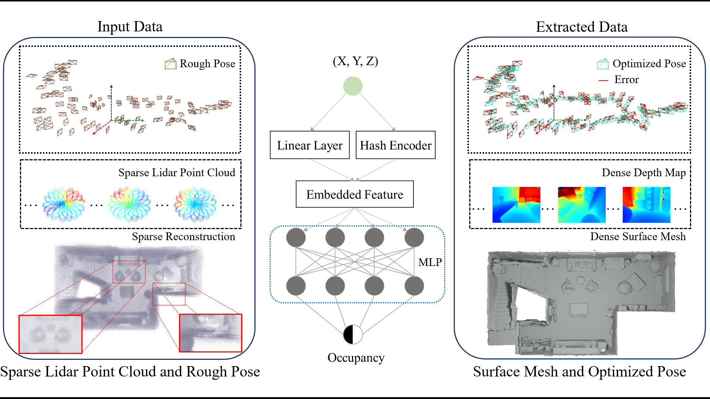

# EINRUL
Efficient Implicit Neural Reconstruction Using LiDAR

### [Paper](https://arxiv.org/abs/2302.14363) | [Project Page](https://starydy.xyz/EINRUL) | [Video](https://www.youtube.com/watch?v=wUp2I-X-IdI)

> Efficient Implicit Neural Reconstruction Using LiDAR <br />
> Dongyu Yan, Xiaoyang Lyu, Jieqi Shi and Yi Lin <br />
> ICRA 2023

<p align="center">
  
</p>

This repository contains code for the paper Efficient Implicit Neural Reconstruction Using LiDAR, an implicit reconstruction method that uses LiDAR scans as input, which is efficient, accurate, and can be applied in various scenarios.

## Install
```
conda env create -f environment.yml
conda activate linof
```
Install [PyPangolin](https://github.com/uoip/pangolin) to enable visualization

## Dataset
We test our code in [9-Synthetic-Scenes](https://github.com/dazinovic/neural-rgbd-surface-reconstruction#dataset), [ScanNet](http://www.scan-net.org/) and [Replica](https://github.com/facebookresearch/Replica-Dataset) dataset.
We also build a self-collected LiDAR scan dataset using [Livox AVIA](https://www.livoxtech.com/avia).
We have packed the scenes we test in the paper, and you can download them [here](https://drive.google.com/file/d/10Ggh1cv-6MVeMkttL8D75axXOvRR62hW/view?usp=sharing) (about 4.96 GB).
Since color information is not needed in our method, we only include depth images and LiDAR scans in the dataset.
For convience, we reformat 9-Synthetic-Scenes and Replica dataset into the same as ScanNet dataset.
The path format of the data is shown below.
### 9-Sythetic-Scenes
<details><summary><em>[Click to expand]</em></summary>

<br>

```
neural_rgbd
├── breakfast_room
    ├── depth                                   # depth images
        ├── 0.png
        ├── 1.png
        ...
    ├── intrinsic                               # intrinsic parameters of the sensor
        ├── intrinsic_depth.txt
    ├── gt_pose                                 # groud truth pose of the sensor
        ├── 0.txt
        ├── 1.txt
        ...
    ├── pose                                    # rough pose of the sensor
        ├── 0.txt
        ├── 1.txt
        ...
    ├── breakfast_room_scannet_vh_clean.ply     # groud truth mesh of the scene
├── complete_kitchen
...
```

</details>

### ScanNet
<details><summary><em>[Click to expand]</em></summary>

<br>

```
scans
├── scene0000_00
    ├── depth                                   # depth images
        ├── 0.png
        ├── 1.png
        ...
    ├── intrinsic                               # intrinsic parameters of the sensor
        ├── intrinsic_depth.txt
    ├── pose                                    # rough pose of the sensor
        ├── 0.txt
        ├── 1.txt
        ...
    ├── scene0000_00_vh_clean.ply               # groud truth mesh of the scene
├── scene0011_00
...
```

</details>

### Replica
<details><summary><em>[Click to expand]</em></summary>

<br>

```
replica
├── frl_apartment_2
    ├── depth                                   # depth images
        ├── 0.png
        ├── 1.png
        ...
    ├── intrinsic                               # intrinsic parameters of the sensor
        ├── intrinsic_depth.txt
    ├── pose                                    # groud truth pose of the sensor
        ├── 0.txt
        ├── 1.txt
        ...
    ├── frl_apartment_2_vh_clean.ply            # groud truth mesh of the scene
├── hotel_0
...
```

</details>

### Outdoor AVIA
<details><summary><em>[Click to expand]</em></summary>

<br>

```
outdoor_avia
├── bridge
    ├── pointcloud                              # point cloud frames
        ├── 0.pcd
        ├── 1.pcd
        ...
    ├── poses.pkl                               # rough pose of the sensor
├── square
...
```
Note that the poses of LiDAR frames are saved as a pickle file, and the format is shown below.
```
[
    {
        "rotation": {x: 0.0, y: 0.0, z: 0.0, w: 1.0},
        "position": {x: 0.0, y: 0.0, z: 0.0}
    },
    ...
]
```

</details>

## Usage

### Configs
We provide config files for different datasets and scene types, but notice that some of the settings may not be suitable for your scene.
You may have to tune them yourself.

Before running the code, you need to set the parameters in the config file:
1. `data_path` : directory of a certain dataset.
2. `scene_path`: directory for generated mid-products and results.
3. `exp_name`: experiment name of a certain scene.

### Frame Selection
Frame selection step select key frames from the input sequence using the strategy mentioned in the paper.

```
python frame_selection.py --config ./configs/your_config.txt
```

### Preprocess
Preprocess step convert the original depth images into pseudo lidar scans.
Note that this step is not needed if you already have LiDAR scans as input.

```
python pseudo_lidar.py --config ./configs/your_config.txt
```

### Reconstrustion
Recosntruction step run the optimization to build the implicit model.

During this step, it may require more than 12Gb GPU memory using the default config.
You can reduce the batch size and increase training step to fit your GPU memory while getting a similar result.

```
python main.py --config ./configs/your_config.txt
```

### Evaluation
Evaluation step convert the implicit model into mesh using Marching Cubes and evaluates the reconstruction result.

```
python eval.py --config ./configs/your_config.txt
```

### Postprocess
After result evaluation, the scene bounding box can be precisely determined.
We then fintune the implicit model using these information for a better reconstruction.

```
python main.py --config ./configs/your_config.txt --finetune
```

Finally, results are obtained by evaluating the fintuned model.
The evaluation options in the config file include:
1. `eval_mesh` to evaluate mesh quality.
2. `eval_depth` to evaluate depth completion quality. (long rendering time)
3. `eval_pose` to evaluate pose refinement quality.

```
python eval.py --config ./configs/your_config.txt --finetune
```

Finally after evaluation, the format of the scene path will become:

<details><summary><em>[Click to expand]</em></summary>

<br>

```
9-synthetic-scenes
├── breakfast_room
    ├── checkpoints                     # saved checkpoints
        ├── 299_map.pt
        ...
    ├── depth                           # selected key frames depth (only for pseudo LiDAR datasets)
        ├── 0.png
        ...
    ├── depth_render                    # rendered depth (depth completion)
        ├── 0_surf.png
        ├── 0_render.png
        ...
    ├── phong_render                    # rendered mesh
        ├── 0_surf.png
        ├── 0_render.png
        ...
    ├── pointcloud                      # selected key frames pointcloud
        ├── 0.pcd
        ...
    ├── bbox_prior.pkl                  # bounding box prior of the scene
    ├── final_pose.pkl                  # refined poses
    ├── key_frames.pkl                  # key frame id with rough poses
    ├── key_frames_gt.pkl               # key frame id with gt poses (only for synthetic datasets)
    ├── final_map.pt                    # final implicit model
    ├── final_pcd.pcd                   # final stitching pointcloud
    ├── final_mesh.ply                  # final mesh
    ├── final_mesh_clean.ply            # final mesh after culling unseen faces
    ├── eval_res.txt                    # evaluation result
├── complete_kitchen
...
```
</details>

## Citation
If you find this work useful for your research, please cite our paper:
```bibtex
@InProceedings{yan2023efficient,
  author = {Dongyu Yan, Xiaoyang Lyu, Jieqi Shi, Yi Lin},
  title = {Efficient Implicit Neural Reconstruction Using LiDAR},
  booktitle={2023 IEEE International Conference on Robotics and Automation (ICRA)},
  year = {2023}}
```
